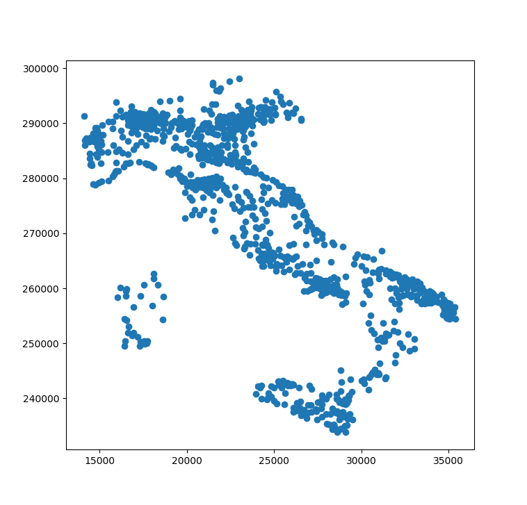
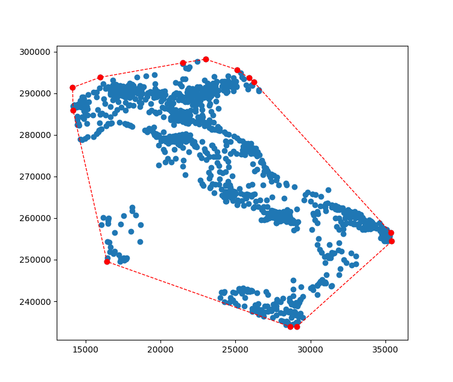
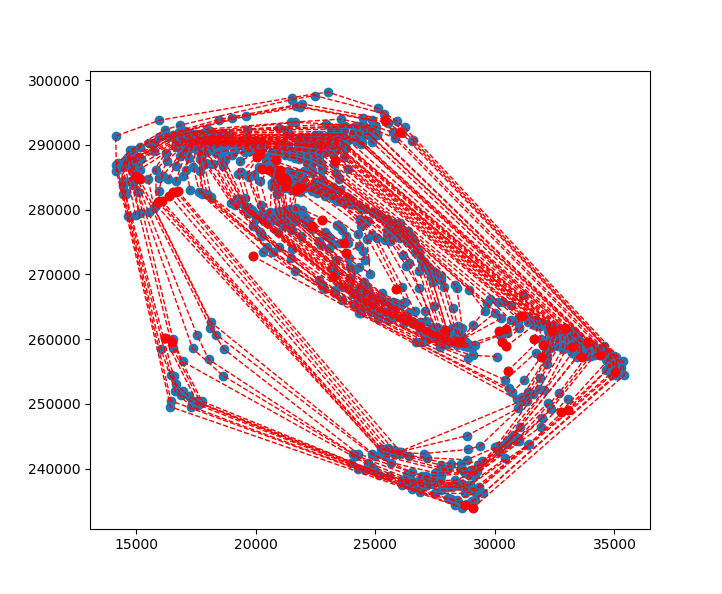

# Country Convex Layer Depth Locator

Class for finding the convex hull peeling depth of a given county by means of a recursive convex hull algorithm.
    
**More on**:

https://en.wikipedia.org/wiki/Convex_layers
    
**Data set taken from**:

https://www.kaggle.com/max-mind/world-cities-database


## Example

```python
    # Find the centroid town in Italy with a minimum population of 1000
    cc = CountryCentroid('world-cities-database.zip', cntry_id='it', min_pop=1000)
    # remove the outlier towns
    cc.remove_outliers_by_zscore()
```
After instantiation and removing the outlier points:
```python
    # plot the towns on a scatter diagram
    cc.scatter_towns()
    plt.show()
```



Now we can plot the outer convex layer of Italy after finding the convex hull vertices:

```python
    # find the convex vertices (first layer)
    cc.find_vertices()
    # plot
    cc.plot_convex_layer()
    plt.show()
```



```python
    # peel the convex layers recursively
    cc.peel()
    # Show on 2d plot
    plt.show()
    # find the most populous town as the center of distribution
    print(cc.find_center_of_dist())
```



```python
    Country            it
    City           arezzo
    AccentCity     Arezzo
    Region             16
    Population      95233
    Latitude      43.4167
    Longitude     11.8833
    X             22913.5
    Y              276608
    Name: 1504134, dtype: object
```
